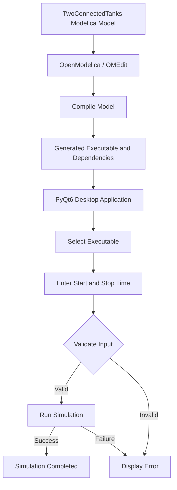

# Two Connected Tanks — OpenModelica Desktop App

A PyQt6 desktop application for running an OpenModelica-generated simulation of the `NonInteractingTanks.TwoConnectedTanks` model.

This project was developed as part of the **FOSSEE/OpenModelica Desktop App Screening Task**.

---

## 📌 Overview

The project consists of two main parts:

1. **OpenModelica Simulation**
   - Load and compile the supplied `TwoConnectedTanks` Modelica model using OpenModelica/OMEdit.
   - Generate the simulation executable and its dependent files.

2. **Python Desktop Application**
   - Build a desktop GUI using Python and PyQt6.
   - Allow the user to select the generated OpenModelica executable.
   - Accept simulation start and stop times.
   - Validate the input parameters.
   - Execute the simulation with the supplied parameters.
   - Display the simulation status and execution errors.

The application provides a simple graphical interface for running the compiled OpenModelica simulation without manually entering simulation commands in a terminal.

---

## 🔄 Application Workflow



### Simulation Parameter Rule

The application enforces the condition:

```text
0 <= start time < stop time < 5
```

For example:

```text
Start Time: 0
Stop Time: 4
```

is valid.

```text
Start Time: 0
Stop Time: 5
```

is invalid because the stop time must be strictly less than `5`.

---

## ✨ Features

- PyQt6-based desktop GUI
- Executable file selection using a file dialog
- Start time input
- Stop time input
- Input validation
- OpenModelica simulation execution
- Command-line simulation parameters
- Simulation success/failure status
- Error reporting through GUI dialogs
- Object-oriented Python application structure
- Organized separation of:
  - Python application
  - Modelica source files
  - Generated simulation files
  - Screenshots

---

## 🛠️ Technologies Used

| Technology | Purpose |
|---|---|
| Python 3.6+ | Desktop application development |
| PyQt6 | Graphical user interface |
| OpenModelica | Model compilation and simulation |
| Modelica | Two Connected Tanks simulation model |
| Windows 10/11 | Development and testing environment |

The current implementation was developed and tested on **Windows**.

---

## 📁 Project Structure

```text
FOSSEE_TwoConnectedTanks/
│
├── app.py
├── requirements.txt
├── README.md
│
├── executable/
│   ├── TwoConnectedTanks.exe
│   ├── TwoConnectedTanks.bat
│   ├── TwoConnectedTanks_init.xml
│   ├── TwoConnectedTanks_info.json
│   ├── TwoConnectedTanks_external_functions.json
│   ├── TwoConnectedTanks_res.mat
│   ├── TwoConnectedTanks.log
│   └── other OpenModelica-generated files
│
├── model/
│   └── NonInteractingTanks/
│       ├── package.mo
│       ├── package.order
│       ├── FlowConnect.mo
│       ├── Tank.mo
│       ├── Tank2.mo
│       └── TwoConnectedTanks.mo
│
└── screenshots/
    ├── condition.png
    ├── generated_files.png
    ├── pyqt_app.png
    └── simulation_success.png
```

> **Note:** The exact generated files may vary depending on the OpenModelica version. The complete generated file set should be kept together because the executable may depend on accompanying initialization, result, metadata, and runtime files.

---

# 🚀 Getting Started

## 1. Prerequisites

Make sure the following are installed:

- Windows 10/11
- Python 3.6 or later
- OpenModelica
- PyQt6

OpenModelica should be installed before attempting to run the simulation.

---

## 2. Install Python Dependencies

Open a terminal in the project directory.

Optionally create a virtual environment:

```bash
python -m venv venv
```

Activate it on Windows:

```bash
venv\Scripts\activate
```

Install the required Python package:

```bash
python -m pip install -r requirements.txt
```

The `requirements.txt` file contains:

```text
PyQt6
```

---

# ▶️ Running the Application

From the project root:

```bash
python app.py
```

The PyQt6 desktop application will open.

---

# 🖥️ Using the Application

### Step 1 — Select the executable

Click the **Browse Executable** button and select:

```text
executable/TwoConnectedTanks.exe
```

The selected executable is the compiled OpenModelica simulation program.

The generated `TwoConnectedTanks.bat` launcher is also retained in the executable directory because OpenModelica-generated Windows simulations may require the runtime environment configured by the launcher.

---

### Step 2 — Enter Start Time

Enter a valid integer start time.

Example:

```text
0
```

---

### Step 3 — Enter Stop Time

Enter a valid integer stop time.

Example:

```text
4
```

---

### Step 4 — Run the Simulation

Click:

```text
Run Simulation
```

The application executes the selected OpenModelica program and passes the simulation parameters using the OpenModelica simulation flags:

```text
-startTime=<value>
-stopTime=<value>
```

For example:

```text
-startTime=0
-stopTime=4
```

---

# 🔍 Input Validation

Before executing the simulation, the application checks:

1. An executable has been selected.
2. Start time is numeric.
3. Stop time is numeric.
4. Start time is greater than or equal to `0`.
5. Start time is less than stop time.
6. Stop time is strictly less than `5`.

The required condition is:

```text
0 <= start time < stop time < 5
```

### Valid Example

```text
Start Time = 0
Stop Time  = 4
```

### Invalid Example

```text
Start Time = 2
Stop Time  = 2
```

Reason:

```text
Start Time must be less than Stop Time.
```

### Invalid Example

```text
Start Time = 0
Stop Time  = 5
```

Reason:

```text
Stop Time must be less than 5.
```

---

# ⚙️ OpenModelica Model Compilation

The supplied Modelica package was loaded into **OMEdit** and the following model was compiled:

```text
NonInteractingTanks.TwoConnectedTanks
```

Compilation generates the simulation executable together with several supporting files.

The generated files were collected into:

```text
executable/
```

Important generated files include:

```text
TwoConnectedTanks.exe
TwoConnectedTanks.bat
TwoConnectedTanks_init.xml
TwoConnectedTanks_res.mat
TwoConnectedTanks_info.json
TwoConnectedTanks_external_functions.json
TwoConnectedTanks.log
```

The executable and its generated companion files should be kept from the same OpenModelica build.

---

# 🧩 Model Compatibility Changes

During development, two minor compatibility changes were made to the supplied Modelica files so that the model could compile and run successfully with the installed OpenModelica version.

### 1. `FlowConnect.mo`

The flow variable was declared using:

```modelica
flow Real F;
```

### 2. `Tank2.mo`

The `V/Q1` calculation was protected against zero-flow conditions to avoid invalid division during simulation.

These changes were made only to ensure compatibility and successful execution with the installed OpenModelica environment.

They are implementation details of this project and are not additional requirements of the screening task.

---

# 📊 Simulation Output

When the simulation completes successfully, OpenModelica generates the simulation result files in the executable directory.

The generated result includes:

```text
TwoConnectedTanks_res.mat
```

The application also checks the process return code and reports the execution status.

A successful execution returns:

```text
Return Code: 0
```

and the OpenModelica output reports successful simulation completion.

---

# 🖼️ Screenshots

The repository contains screenshots demonstrating the implementation and testing process.

### OpenModelica Generated Files


### PyQt6 Application


### Input Validation


### Successful Simulation


---

# 🧱 Application Design

The desktop application follows an object-oriented structure.

The main GUI functionality is encapsulated in the application class.

The application is responsible for:

```text
GUI creation
     ↓
User input
     ↓
Input validation
     ↓
Executable selection
     ↓
Simulation process execution
     ↓
Return-code checking
     ↓
Status / error reporting
```

This keeps the user interface and simulation execution logic organized within the application rather than relying on manual terminal commands.

---

# 🐛 Troubleshooting

## OpenModelica executable fails to start

Make sure:

- OpenModelica is installed.
- The generated executable is present.
- The generated supporting files are present.
- The executable and `_init.xml` file belong to the same OpenModelica build.

If the generated Windows executable requires OpenModelica runtime DLLs, use the generated `.bat` launcher or ensure the OpenModelica runtime is available in the system environment.

---

## Simulation input is rejected

Check that:

```text
0 <= start < stop < 5
```

For example:

```text
0 → 4
```

is valid.

---

## Simulation fails after changing generated files

Do not mix generated files from different OpenModelica builds.

Regenerate the model and copy the complete generated output into:

```text
executable/
```

---

## Simulation returns a non-zero return code

Check:

```text
TwoConnectedTanks.log
```

and the terminal output for additional OpenModelica diagnostic information.

Also verify that the executable has access to its required runtime dependencies.

---

# ✅ Verification

The application was tested using:

```text
Start Time: 0
Stop Time: 4
```

The simulation completed successfully with:

```text
Return Code: 0
```

The OpenModelica output also reported successful initialization and simulation completion.

The input validation was additionally tested with invalid time combinations to ensure that the required condition:

```text
0 <= start time < stop time < 5
```

is enforced.

---

# 📋 Screening Task Requirements

The implementation addresses the major requirements of the screening task:

| Requirement | Status |
|---|---|
| Python 3.6+ | ✅ |
| PyQt6 | ✅ |
| OpenModelica | ✅ |
| Compile `TwoConnectedTanks` | ✅ |
| Generated executable | ✅ |
| Dependent generated files | ✅ |
| Executable selection | ✅ |
| Start time input | ✅ |
| Stop time input | ✅ |
| Parameter passing | ✅ |
| Input validation | ✅ |
| Simulation execution | ✅ |
| Error handling | ✅ |
| OOP implementation | ✅ |
| Documentation | ✅ |
| Windows 10/11 testing | ✅ |

---

# 📚 References

- [OpenModelica](https://openmodelica.org/)
- [OpenModelica User Guide — Simulation Flags](https://openmodelica.org/doc/OpenModelicaUsersGuide/latest/simulationflags.html#simflag-override)
- [Python](https://www.python.org/)
- [PyQt6](https://pypi.org/project/PyQt6/)

---

# 👩‍💻 Author

**Shloka Loni**

FOSSEE / OpenModelica Desktop App Screening Task
