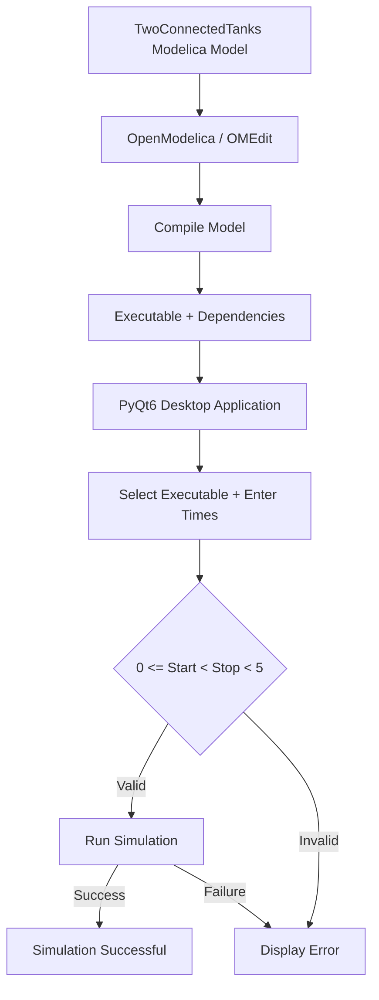

# Two Connected Tanks — OpenModelica Desktop App

A PyQt6 desktop application for running an OpenModelica-generated
simulation of the `NonInteractingTanks.TwoConnectedTanks` model.

This project was developed as part of the **FOSSEE/OpenModelica Desktop App
Screening Task**.

---

## 📌 Overview

The project consists of two main parts:

1. Compiling the supplied `TwoConnectedTanks` Modelica model using
   OpenModelica to generate a simulation executable and its dependent files.
2. Building a Python/PyQt6 desktop application that allows the user to
   select the generated executable, provide simulation start and stop times,
   and launch the simulation.

The application validates the simulation parameters before execution and
reports whether the simulation completed successfully.

---

## 🔄 Workflow



### Workflow Description

- The supplied Modelica model is loaded into OpenModelica/OMEdit.
- `NonInteractingTanks.TwoConnectedTanks` is compiled to generate the
  simulation executable and its dependent files.
- The generated executable is placed inside the `executable/` directory.
- The PyQt6 application allows the user to browse and select the executable.
- The user enters the simulation start time and stop time.
- The application validates the required condition:
  `0 <= start time < stop time < 5`.
- The executable is launched with the corresponding OpenModelica
  simulation arguments.
- The application reports whether the simulation was successful or failed.
- OpenModelica generates simulation result and log files which can also
  be inspected using OMEdit.

---

## ✨ Features

- PyQt6-based desktop GUI
- Executable file selection using a file dialog
- Start time input
- Stop time input
- Input validation
- Enforces the required condition:

  `0 <= start time < stop time < 5`

- Passes start and stop time parameters to the OpenModelica executable
- Executes the compiled OpenModelica simulation
- Displays simulation status
- Displays execution errors when the simulation fails
- Uses an object-oriented Python application structure
- Keeps the Modelica model, executable and GUI code organized separately

---

## 🛠️ Technologies Used

- **Python 3.6+**
- **PyQt6**
- **OpenModelica**
- **Windows 10/11**

The current implementation was developed and tested on **Windows**.

---

## 📁 Project Structure

```text
FOSSEE_TwoConnectedTanks/
│
├── app.py
├── requirements.txt
├── README.md
│
├── executable/
│   ├── TwoConnectedTanks.bat
│   ├── TwoConnectedTanks.exe
│   ├── TwoConnectedTanks_init.xml
│   ├── TwoConnectedTanks_info.json
│   ├── TwoConnectedTanks_external_functions.json
│   ├── TwoConnectedTanks_JacA.bin
│   ├── TwoConnectedTanks_prof.intdata
│   ├── TwoConnectedTanks_prof.realdata
│   ├── TwoConnectedTanks_res.mat
│   └── TwoConnectedTanks.log
│
├── model/
│   └── NonInteractingTanks/
│       ├── package.mo
│       ├── package.order
│       ├── FlowConnect.mo
│       ├── Tank.mo
│       ├── Tank2.mo
│       └── TwoConnectedTanks.mo
│
└── screenshots/
    ├── condition1.png
    ├── condition2.png
    ├── generated_files.png
    ├── given_condition.png
    └── simulation_success.png
```

> The exact generated files may vary slightly depending on the
> OpenModelica version. The complete generated file set should be kept
> together with the compiled executable.

---

## ⚙️ Requirements

Before running the application, make sure the following are installed:

- Windows 10/11
- Python 3.6 or later
- OpenModelica
- PyQt6

OpenModelica is required because the application executes the compiled
OpenModelica simulation program.

---

## 📦 Installation

Clone the repository:

```bash
git clone https://github.com/shlokaloni282/FOSSEE-IITB-AUTUMN-TASKS---OPENMODELICA-DESKTOP-APP.git
```

Navigate to the project directory:

```bash
cd FOSSEE-IITB-AUTUMN-TASKS---OPENMODELICA-DESKTOP-APP
```

Navigate to the application directory:

```bash
cd FOSSEE_TwoConnectedTanks
```

Install the Python dependency:

```bash
python -m pip install -r requirements.txt
```

The `requirements.txt` file contains:

```text
PyQt6
```

---

## ▶️ Run the Application

From the `FOSSEE_TwoConnectedTanks` directory, run:

```bash
python app.py
```

The PyQt6 desktop application will open.

---

## 🖥️ Using the Application

### Step 1 — Select the executable

Click **Browse Executable** and select:

```text
executable/TwoConnectedTanks.exe
```

The application uses the compiled OpenModelica executable generated from
the `TwoConnectedTanks` model.

### Step 2 — Enter the start time

Enter an integer start time.

For example:

```text
3
```

### Step 3 — Enter the stop time

Enter an integer stop time greater than the start time.

For example:

```text
4
```

### Step 4 — Run the simulation

Click **Run Simulation**.

The application validates the input values and executes the selected
OpenModelica program with the specified simulation times.

---

## ✅ Input Validation

The application checks the following conditions before running the
simulation:

1. An executable must be selected.
2. Start time must be numeric.
3. Stop time must be numeric.
4. The values must satisfy:

```text
0 <= start time < stop time < 5
```

### Valid Example

```text
Start Time: 3
Stop Time: 4
```

This satisfies:

```text
0 <= 3 < 4 < 5
```

### Invalid Example

```text
Start Time: 0
Stop Time: 5
```

This is rejected because the task requires:

```text
stop time < 5
```

The application displays an appropriate validation message instead of
starting the simulation.

---

## 🔧 OpenModelica Simulation Arguments

The start and stop times entered through the GUI are passed to the
compiled OpenModelica executable using the simulation command-line
options:

```text
-startTime=<value>
-stopTime=<value>
```

For example, for:

```text
Start Time: 3
Stop Time: 4
```

the application executes the simulation using parameters equivalent to:

```text
-startTime=3
-stopTime=4
```

This allows the same compiled simulation executable to be run with
different valid simulation time ranges.

---

## 🧩 Model and Simulation Workflow

The supplied model package contains:

```text
NonInteractingTanks
└── TwoConnectedTanks
```

The model was loaded and compiled using OpenModelica/OMEdit.

Compilation generates:

```text
TwoConnectedTanks.exe
```

along with supporting files such as:

```text
TwoConnectedTanks_init.xml
TwoConnectedTanks_info.json
TwoConnectedTanks_external_functions.json
TwoConnectedTanks_res.mat
TwoConnectedTanks.log
```

These generated files are retained in the `executable/` directory.

The executable and its corresponding generated files should remain
together because some generated files are required by the simulation
runtime.

---

## Model Compatibility Changes

During development, two minor compatibility changes were required to run
the supplied model package with the installed OpenModelica version:

1. `FlowConnect.mo`
   - Changed `Real F;` to `flow Real F;`.

2. `Tank2.mo`
   - Added protection for the `V/Q1` calculation when the flow is zero.

These changes were made only to ensure the supplied model could be compiled
and simulated successfully with the installed OpenModelica version. They are documented
here for transparency.

---

## 📊 Generated Simulation Results

When the simulation runs successfully, OpenModelica generates result
and diagnostic files in the executable directory.

Important files include:

### `TwoConnectedTanks.exe`

The compiled OpenModelica simulation executable launched by the PyQt6
application.

### `TwoConnectedTanks_res.mat`

The generated simulation result file. It can be loaded and inspected
using OMEdit for plotting and variable analysis.

### `TwoConnectedTanks.log`

Contains simulation log and diagnostic information.

### `TwoConnectedTanks_init.xml`

Contains initialization information associated with the compiled model.

> The executable and its generated initialization/dependency files should
> come from the same OpenModelica build. Do not mix files from different
> builds.

---

## 📸 Screenshots

The `screenshots/` directory contains screenshots demonstrating the
development and testing of the application.

### Input Validation


### Required Condition


### Generated OpenModelica Files


### Successful Simulation


The successful simulation screenshot demonstrates the PyQt6 application
running the compiled OpenModelica executable with valid simulation
parameters and receiving successful simulation output.

---

## 🧪 Verification

The application was tested using valid simulation parameters satisfying
the required condition.

Example test:

```text
Start Time = 3
Stop Time = 4
```

The application successfully executed the compiled
`TwoConnectedTanks.exe`.

The simulation returned:

```text
Return Code: 0
```

and OpenModelica reported:

```text
LOG_SUCCESS
The simulation finished successfully.
```

The generated `.mat` result file can subsequently be opened in OMEdit
for inspecting simulation variables and plots.

---

## 🛠️ Troubleshooting

### PyQt6 is not installed

Install the dependencies using:

```bash
python -m pip install -r requirements.txt
```

or:

```bash
python -m pip install PyQt6
```

---

### The application rejects the time values

Make sure the values satisfy:

```text
0 <= start < stop < 5
```

For example:

```text
Start Time: 3
Stop Time: 4
```

is valid.

---

### The simulation fails

Check:

- The selected executable exists.
- The executable is the generated `TwoConnectedTanks.exe`.
- The generated dependency files are present in the same directory.
- OpenModelica is correctly installed.
- `TwoConnectedTanks.log` for simulation diagnostics.

---

### The result file cannot be loaded correctly

Make sure the `.exe`, `_init.xml`, and other generated files belong to the
same OpenModelica compilation. Regenerate the model if necessary rather
than mixing files from different builds.

---

## 🎯 Task Requirements Addressed

| Requirement | Implementation |
|---|---|
| Python 3.6+ | Implemented using Python |
| PyQt6 | Used for the desktop GUI |
| OpenModelica | Used to compile and generate the simulation executable |
| Executable selection | Implemented using a file dialog |
| Start time | GUI input field |
| Stop time | GUI input field |
| Simulation execution | Implemented using the compiled executable |
| Simulation parameters | Passed using `-startTime` and `-stopTime` |
| Required condition | `0 <= start < stop < 5` enforced |
| Error handling | Implemented |
| OOP | GUI implemented using a Python class |
| Documentation | README and screenshots provided |

---

## Demo Video:
GOOGLE DRIVE: https://drive.google.com/file/d/1u2oVr92HOHFEQC5eQKWSRRKv60xN_-Rg/view?usp=drive_link

YT: https://youtu.be/suJPSYih86g?si=Ver_04NhYAQf87yW

## 👩‍💻 Author

**Shloka Loni**

FOSSEE/OpenModelica Desktop App Screening Task
